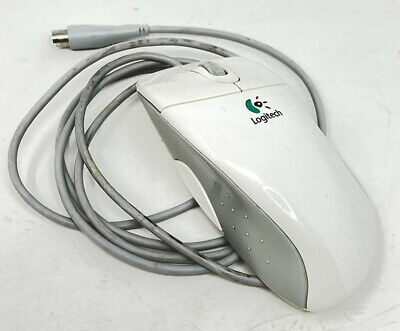

# Logitech-MouseMan-M-CW47
xbindkeys config for MouseMan+ M-CW47



## Installation
Install `xbindkeys` and `xdotool`

## Configuration
Search `/home/user/.xbindkeysrc` or, if the file doesn't exist, create it.

Copy and paste
```
#x4
"xdotool key Super+w"
    b:8
```

As you have configured `Super+w` as the overview shortcut in KDE the thumb button of MouseMan+ display the overview when clicked.
Enable in the startup script `xbindkeys` using 
```
#!/usr/bin/bash
xbindkeys
```
